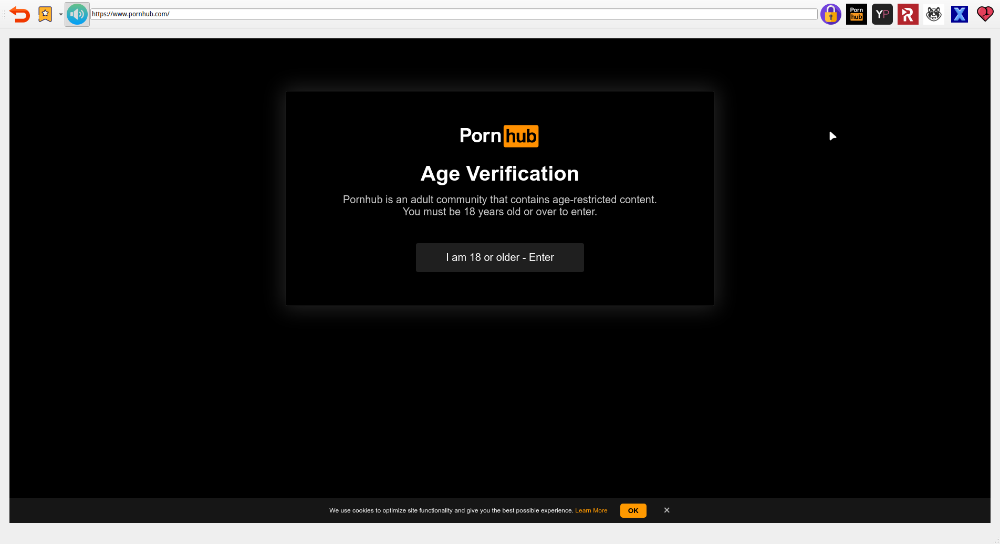

# SecretCrush 🍑

Welcome to **SecretCrushBrowser 🍑**, the stealthy browser disguised as your favorite Candy Crush game! With SecretCrush, you get the best of both worlds—a secure browsing experience wrapped in a playful, unsuspecting interface. Access your hidden browser with a quick key shortcut and keep your online activities under wraps.

## Why SecretCrush?

- **🔒 Top-Notch Security**:
  Your browsing history, bookmarks, and personal data are well-protected from prying eyes. SecretCrush ensures your online activities stay hidden and secure.

- **📚 Effortless Bookmarks Management**:
  Organize your video library with ease! Bookmark and categorize your favorite videos to keep your collection neatly arranged and readily accessible.

- **🚪 Failsafe Feature**:
  Leave a video or other content unattended? No problem! SecretCrush will automatically lock and hide itself to ensure your privacy.

- **🔳 Out Focus Blur**:
  Prevent unauthorized viewing with automatic screen blurring when your cursor exits the browser window. Your content remains safe, even if you're distracted.

- **⏱️ Session Statistics**:
  Turn 🥒💦 into a game! Use the built-in timer and view detailed statistics to track and gamify your sessions. Challenge yourself and see how you stack up!

## Getting Started

1. **Installation**:
   - Download SecretCrushBrowser 🍑 from our official torrent or a trusted source.
   - Follow the simple installation steps for your operating system.

2. **Using the Browser**:
   - Launch SecretCrush by clicking on the Candy Crush icon.
   - Use the provided key shortcuts to swiftly access and hide your browser.

3. **Security Settings**:
   - Customize security features to suit your needs, including password protection.

4. **Timers and Stats**:
   - Activate the built-in timer to track your sessions.
   - Explore detailed statistics to make your 🥒💦 experience more engaging and track your progress.

## Disclaimer

SecretCrushBrowser 🍑 is designed for enhanced privacy and security. Use responsibly and in accordance with all applicable laws and regulations.

#### What others see:

#### The hidden reality:

